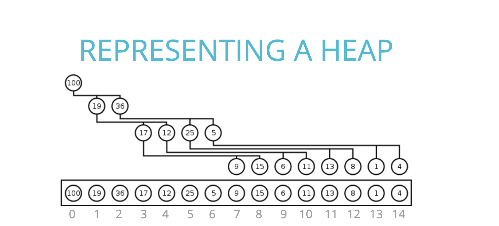

# binary-heaps

## rules
in a <b>max binary heap</b> parent nodes are always larger than child node. in a <b>min binary heap</b> parent nodes are always smaller than child nodes
<b>but</b> order does not exist between left and right child node

### max binary heap

1. Each parent has at most two child nodes
2. The value of each parent node is always greater than its child nodes
3. In a max binary heap, the parent is greater than the children, but there are no guarantees between sibling nodes.
4. A binary heap is as compact as possible. All the children of each node are as full as they can be andleft children are filled out first
``` javascript
class MaxBinaryHeap {
  constructor() {
    this.values = [];
	this.size = 0
  }
}
```

### insert
- Push the value into the values property on the heap
- Bubble Up:
    1. Create a variable called index which is the length of he values property -1
    2. Create a varible called parentIndex which is the floor of (index-1)/2
    3. Keep looping as long as the values element at the parentindex is less than the values element at the child index
        - Swap the value of the values element at the parentIndex with the value of the element property at the child index
        - Set the index to be the parentIndex, and start over
```javascript
  insert(element) {
    this.values.push(element);
    this.bubbleUp();
	this.size++
  }
  bubbleUp() {
    let idx = this.values.length - 1;
    const element = this.values[idx];
    while (idx > 0) {
      let parentIdx = Math.floor((idx - 1) / 2);
      let parent = this.values[parentIdx];
      if (element <= parent) break;
      this.values[parentIdx] = element;
      this.values[idx] = parent;
      idx = parentIdx;
    }
  }
```
### extract

1. Swap thr first value in thr values property with thr last one
2. Pop from the values property, so you can return the value at the end.
3. Have the new root "sink down" to the correct spot
    - Your parent index starts at 0(the root)
    - Find the index of the left child: 2*index + 1 (make sure its not out of bounds)
    - Find the index of the right child: 2*index + 2 (make sure its not out of bounds)
    - If the left or right child is greater than the element... swap. if both left and right children are larger, swap with the largest child
    - The child index you swapped to now becomes the new parent index
    - Keep looping and swapping until neither child is larger than the element.
    - Return the old root
```javascript
  extractMax() {
    const max = this.values[0];
    const end = this.values.pop();
    if (this.values.length > 0) {
      this.values[0] = end;
      this.sinkDown();
    }
		this.size--
    return max;
  }
  sinkDown() {
    let idx = 0;
    const length = this.values.length;
    const element = this.values[0];
    while (true) {
      let leftChildIdx = 2 * idx + 1;
      let rightChildIdx = 2 * idx + 2;
      let leftChild, rightChild;
      let swap = null;

      if (leftChildIdx < length) {
        leftChild = this.values[leftChildIdx];
        if (leftChild > element) {
          swap = leftChildIdx;
        }
      }
      if (rightChildIdx < length) {
        rightChild = this.values[rightChildIdx];
        if (
          (swap === null && rightChild > element) ||
          (swap !== null && rightChild > leftChild)
        ) {
          swap = rightChildIdx;
        }
      }
      if (swap === null) break;
      this.values[idx] = this.values[swap];
      this.values[swap] = element;
      idx = swap
    }
  }
```

## priority queue
```javascript
class PriorityQueue {
    constructor(){
        this.values = [];
        this.size = 0
    }
    enqueue(val, priority){
        let newNode = new Node(val, priority);
        this.values.push(newNode);
        this.bubbleUp();
        this.size++
    }
    bubbleUp(){
        let idx = this.values.length - 1;
        const element = this.values[idx];
        while(idx > 0){
            let parentIdx = Math.floor((idx - 1)/2);
            let parent = this.values[parentIdx];
            if(element.priority >= parent.priority) break;
            this.values[parentIdx] = element;
            this.values[idx] = parent;
            idx = parentIdx;
        }
    }
    dequeue(){
        const min = this.values[0];
        const end = this.values.pop();
        if(this.values.length > 0){
            this.values[0] = end;
            this.sinkDown();
        }
        this.size--
        return min;
    }
    sinkDown(){
        let idx = 0;
        const length = this.values.length;
        const element = this.values[0];
        while(true){
            let leftChildIdx = 2 * idx + 1;
            let rightChildIdx = 2 * idx + 2;
            let leftChild,rightChild;
            let swap = null;

            if(leftChildIdx < length){
                leftChild = this.values[leftChildIdx];
                if(leftChild.priority < element.priority) {
                    swap = leftChildIdx;
                }
            }
            if(rightChildIdx < length){
                rightChild = this.values[rightChildIdx];
                if(
                    (swap === null && rightChild.priority < element.priority) || 
                    (swap !== null && rightChild.priority < leftChild.priority)
                ) {
                   swap = rightChildIdx;
                }
            }
            if(swap === null) break;
            this.values[idx] = this.values[swap];
            this.values[swap] = element;
            idx = swap;
        }
    }
}

class Node {
    constructor(val, priority){
        this.val = val;
        this.priority = priority;
    }
}
```